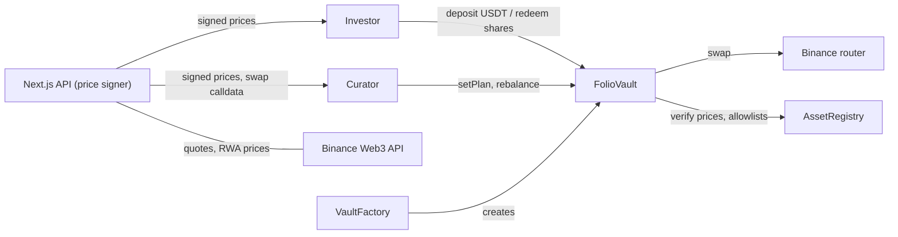

# Folio Lab

**Pooled portfolios of tokenized US stocks on BNB Smart Chain.**

A curator opens a vault and publishes, on-chain, a plan for what they intend to buy. Investors deposit USDT and receive vault shares. The curator invests the pooled USDT in tokenized stocks (Ondo's AAPLon, NVDAon, AVGOon, TSMon) through the Binance Web3 trading router.

Built for the BNB Chain Tokenized Stocks hackathon.

| | |
|---|---|
| Live app | _Vercel URL: to be added_ |
| Chain | BSC mainnet (chainId 56) |
| Binance Web3 API | Market API (RWA tokens, platforms, underlying market data) and Aggregator API (quote, swap) |
| Stack | Solidity 0.8.30 + Foundry · Next.js 16 + React 19 · wagmi + viem |

## What the contracts guarantee

- **The curator can trade but can never withdraw.** A trade can only swap one allowlisted token for another through an allowlisted router. Balance checks before and after each trade make sure nothing else leaves the vault.
- **Each trade can lose at most 2%.** The vault values both sides of every trade at signed market prices and reverts if the value bought is below 98% of the value sold.
- **Withdrawals never close.** Any holder can redeem their share of every holding at any time, even while the vault is paused. If one stock token is frozen, `redeemExcept` lets a holder leave it behind and take the rest.
- **Deposits never dilute existing holders.** New shares are priced from the vault's full holdings, using backend-signed prices (EIP-712, at most 60 s old) and rounded in favour of existing holders.
- **The plan is public.** `setPlan` stores the curator's plan as free text, with a version number. A plan must exist before the first trade, and every `Rebalanced` event records which plan version it ran under.

## Mainnet deployment

| Contract | Address |
|---|---|
| AssetRegistry | [`0x9262e9FA139113B32621581FD38250C7Da257ba7`](https://bscscan.com/address/0x9262e9FA139113B32621581FD38250C7Da257ba7) |
| VaultFactory | [`0x4F0e39A8d9D3cB7a4D77B77aD310CC3969F15603`](https://bscscan.com/address/0x4F0e39A8d9D3cB7a4D77B77aD310CC3969F15603) |
| Binance router (allowlisted) | [`0xB44446b0c8E56988c34f7Ff73Ae904982b5FdDA5`](https://bscscan.com/address/0xB44446b0c8E56988c34f7Ff73Ae904982b5FdDA5) |
| USDT | [`0x55d398326f99059fF775485246999027B3197955`](https://bscscan.com/address/0x55d398326f99059fF775485246999027B3197955) |

Allowlisted stocks: [AAPLon](https://bscscan.com/token/0x390a684EF9cADE28A7AD0DFa61AB1Eb3842618c4), [NVDAon](https://bscscan.com/token/0xA9eE28C80f960B889dFbd1902055218cBa016F75), [AVGOon](https://bscscan.com/token/0x0ED2E3180EDf393e6bf8Db124bD15DDD54dE150A), [TSMon](https://bscscan.com/token/0xC37042A7a4fa510D8884a433762aB87257B91965).

### Demo transactions

_To be added after the mainnet run: create vault, seed, post plan, rebalance, deposit, redeem._

## How it works



1. **Create.** Anyone calls `VaultFactory.createVault` and names a manager (the curator).
2. **Seed and activate.** The first deposit (`seed`, at least 10 USDT) sets the starting share price, then the guardian activates the vault.
3. **Plan.** The curator posts the plan (`setPlan`). Investors see it on the vault page.
4. **Deposit.** The investor approves USDT. The app fetches signed prices from `/api/prices` and calls `deposit`.
5. **Rebalance.** The curator console calls `/api/trade`, which gets a Binance quote and swap calldata addressed to the vault, and `/api/prices`, then sends `rebalance`.
6. **Redeem.** Holders burn shares and receive their percentage of each held token directly.

Why prices are signed off-chain: no reliable on-chain price feed exists for these stock tokens on BSC. The backend reads Binance RWA prices, refuses to sign a token Binance does not report as trading or whose price is more than 2% away from the underlying stock's reference price, and signs an EIP-712 `PriceUpdate` that the registry verifies on-chain.

## Repository

| Path | What |
|---|---|
| `contracts/` | Foundry project: `AssetRegistry`, `VaultFactory`, `FolioVault`, deploy script, 144 tests. See [`contracts/README.md`](contracts/README.md). |
| `app/api/` | Route handlers: `/api/prices`, `/api/trade`, `/api/vaults`, `/api/history` |
| `lib/binance/` | Signed Binance Web3 API client |
| `lib/contracts/` | ABIs, deployed addresses, wagmi config and hooks |
| `app/page.tsx`, `components/` | Investor app: vault list, vault page, deposit, withdraw |
| `app/curator/`, `components/curator/` | Curator console: create, seed, plan, rebalance |
| `api/` | Standalone Binance Web3 API explorer used during development |
| `docs/` | Contract spec and product requirements |

## Run it locally

Requirements: Node 24, [Foundry](https://book.getfoundry.sh/), and a Binance Web3 API key from the [developer portal](https://web3.binance.com/en/dev-portal/project).

```bash
npm install
cp .env.example .env.local     # fill in the Binance key/secret and a price-signer key
```

### Against a local chain (no real funds)

```bash
anvil --block-time 1           # terminal 1
scripts/dev-chain.sh           # terminal 2: deploys contracts and two demo vaults
npm run dev                    # http://localhost:3000, curator console at /curator
```

Set `CHAIN_RPC_URL=http://127.0.0.1:8545` in `.env.local`, and import anvil account 0 into your wallet.

### Against BSC mainnet

In `.env.local`, set `CHAIN_RPC_URL` to a BSC RPC endpoint and `PRICE_SIGNER_PRIVATE_KEY` to the key of the registry's price signer. Then:

```bash
NEXT_PUBLIC_CHAIN=bsc NEXT_PUBLIC_RPC_URL=https://bsc-dataseed.bnbchain.org npm run dev
```

### Tests

```bash
cd contracts && forge test                                   # contracts
forge test --match-contract SimulationTest -vv               # the whole flow as a story
npm test                                                     # app and API
```

## Limits and known issues

- **Liquidity is the real constraint.** Before allowlisting, we surveyed Binance routes on a mainnet fork at 200 and 1,000 USDT. AAPLon, NVDAon, AVGOon and TSMon filled within 1%. Other Ondo tokens lost 6–96% or could not be quoted, so they are not allowlisted.
- **Hackathon governance.** The deployer is both registry owner and guardian, with no timelock. Production needs a timelock and a multisig.
- **Deposits trust the backend's price signer.** A compromised signer could misprice deposits, although it can never move funds out of a vault.
- Open security findings are listed in [`contracts/KNOWN_ISSUES.md`](contracts/KNOWN_ISSUES.md). They were accepted for the demo and must be fixed before real investor money goes in.

## Developer-experience report

_Written by the team. Link to be added._
