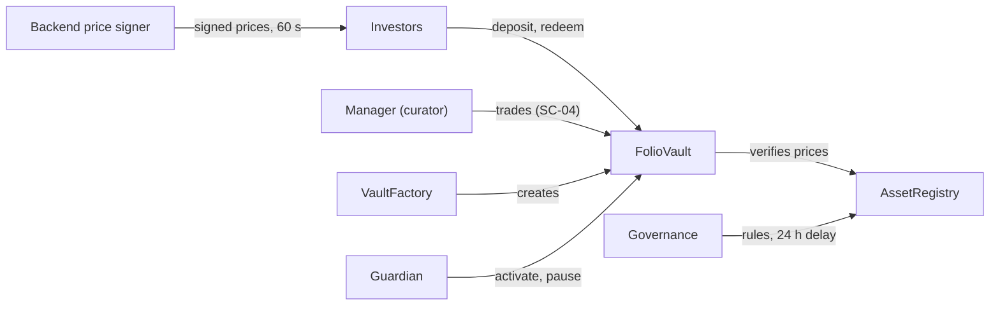

# Folio Lab contracts

Foundry project for the pooled portfolio vault. Owner: **Aik Wei** (PRD tasks SC-01 – SC-07).

- Scope and acceptance criteria: [`docs/folio-lab-pooled-fund-prd.md`](../docs/folio-lab-pooled-fund-prd.md)
- Full design spec (maths, interface, events, risks, decisions): [`docs/folio-lab-contract-architecture.md`](../docs/folio-lab-contract-architecture.md)
- Task tracker: [`docs/sc-checklist.md`](../docs/sc-checklist.md)

## What Folio Lab is

Folio Lab lets anyone run a **pooled portfolio of tokenized US stocks on BNB Chain**. A curator
creates a vault and manages it. Investors deposit USDT and receive vault shares. The curator
invests the pooled USDT in approved stock tokens (Ondo's AAPLon, NVDAon and similar).

Shares work like ETF units: each holder owns a fixed percentage of everything in the vault.
Shares cannot be transferred or traded. They are only minted on deposit and burned on withdrawal.

What the contracts guarantee:

- **The manager can trade but never withdraw.** Trades are limited to approved tokens on approved routers.
- **Exit is always open.** Any holder can withdraw their percentage of every holding at any time, even while the vault is paused.
- **Deposits never dilute existing holders.** New shares are minted at the fair price, rounded in the existing holders' favour.

## Status

A vault can be created, seeded, deposited into, paused and withdrawn from today. Manager
trading is the next build. All 111 Foundry tests pass.

**Not mainnet-ready.** Deposits trust backend-signed prices, and the adversarial review (SC-07)
has not run.

| Task | What it adds | Status |
|---|---|---|
| SC-02 | Registry, factory, vault, `seed`, `activate` | Built, reviewed |
| SC-03 | Signed-price `deposit`, `pause` / `unpause` | Built, reviewed |
| SC-05 | `redeem` and `redeemExcept` (withdraw in kind) | Built, reviewed |
| SC-04 | Manager trading with balance checks (`rebalance`) | Not started |
| SC-06 | Replace manager, close a vault | Not started |
| SC-07 | Invariant and adversarial tests, deploy scripts, ABI handoff | Not started |

## How it works

There are three contracts: one shared `AssetRegistry`, one `VaultFactory`, and one `FolioVault`
per curator. The vault is itself the share token.



Only investors move money in and out of the vault. Governance and the guardian change rules and
state, and the backend only signs prices.

| Contract | Job |
|---|---|
| `AssetRegistry` | Approved stock tokens and trading routers, the USDT address, the guardian and price-signer addresses. Verifies signed prices. Owned by governance. |
| `VaultFactory` | Anyone can create a vault and name its manager. Holds no funds. |
| `FolioVault` | Holds the assets, mints and burns shares, runs the lifecycle, deposits and withdrawals. |

| Role | Who | Can |
|---|---|---|
| Governance | Timelock (24 h) controlled by the team Safe | Edit allowlists, set the guardian and price signer, replace a manager |
| Guardian | Team Safe, no delay | Activate, pause and unpause a vault |
| Price signer | Backend hot key | Sign stock prices for deposits; nothing else |
| Manager | Curator wallet, one per vault | Trade (SC-04) |
| Anyone | Any wallet | Create a vault, seed it, deposit, withdraw |

**Vault lifecycle:** `DRAFT` → `seed()` → `SEEDED` → guardian `activate()` → `ACTIVE` ⇄ `PAUSED`.
Deposits need `ACTIVE`. Withdrawals work in every state.

**Seed.** The first deposit must be at least 10 USDT and mints 1 share per USDT. 0.001 shares go
to `0xdEaD` forever, to block the inflation attack.

**Deposit.** The investor's USDT sits idle in the vault until the curator invests it. Shares are
minted instantly:

```
shares = deposit × totalSupply ÷ vaultValue        (rounded down)
```

The vault value is the vault's own balances multiplied by backend-signed prices. USDT always
counts as $1.

**Withdraw.** `redeem(shares, to)` burns shares and pays the same percentage of every holding, in
kind, with no price involved. If an issuer pauses one held token, `redeemExcept` skips that token,
so exit is never blocked.

## Key decisions and the trust trade-off

The biggest decision is that **deposits are priced from backend-signed stock prices**. Investors
get shares instantly, and their USDT sits idle until the curator invests it. The cost is that the
contract trusts a price it cannot check.

**Why a signed price.** No reliable on-chain price exists for these tokens on BSC (checked
1 October 2026):

- Chainlink's Ondo-token feeds are Ethereum-only.
- The plain AAPL/NVDA/TSLA/MSFT feeds freeze at the US close.
- Pyth equity data is paid.
- DEX pools hold about $17k.

So the backend reads the Binance RWA price API and signs the prices.

**The risk.** A wrong or leaked price lets someone deposit at a low price and withdraw real
assets, which takes value from existing holders. Guardrails:

- Prices older than **60 seconds** are rejected, so the backend signs per deposit.
- The vault values itself from its **own balances**. The backend supplies prices only.
- Any held stock without a price, or with a zero price, makes the deposit revert.
- The guardian can **pause deposits instantly**, and withdrawals keep working.
- The signer is a dedicated key with no other power, and governance can rotate it.

Other decisions:

| Decision | Answer |
|---|---|
| Settlement token | USDT |
| Minimum seed | 10 USDT |
| Is the seeder the manager? | No. Anyone can seed a `DRAFT` vault. |
| Governance | One team, two keys: slow (timelocked) and fast (guardian) |
| Delay before a new depositor can withdraw | None |
| Share transfers | Disabled |

## Setup

This project uses git submodules, so a plain `git clone` will leave `lib/` empty:

```bash
git clone --recurse-submodules git@github.com:noobstar3310/bnb-hack.git
# already cloned:
git submodule update --init --recursive
```

Then:

```bash
cd contracts
cp .env.example .env     # fill in RPC + Etherscan key
forge build
forge test               # expect 111 passing
```

To see the whole flow as a story, run:

```bash
forge test --match-contract SimulationTest -vv
```

It prints ten chapters with seven actors:

1. The team deploys the contracts.
2. Alice creates a vault and Bob seeds it.
3. Carol deposits, and Mallory's fake prices fail.
4. A pause blocks deposits while Bob still withdraws.

## Repo layout

| Path | What is there |
|---|---|
| `src/` | `AssetRegistry.sol`, `VaultFactory.sol`, `FolioVault.sol` |
| `test/` | Unit, fuzz and simulation tests |
| `test/helpers/` | A test-only vault that fakes manager trades until SC-04, plus shared fixtures |
| `test/mocks/` | Mock tokens: configurable decimals, fee-on-transfer, reentrant, pausable |
| `script/` | Deploy scripts (SC-07, empty for now) |
| `../docs/superpowers/plans/` | Step-by-step build plans for each batch of work |

## Commands

| Command | Purpose |
|---|---|
| `forge build` | Compile |
| `forge test` | Run tests (512 fuzz runs) |
| `FOUNDRY_PROFILE=deep forge test` | 10,000 fuzz runs, deeper invariants — before any deploy |
| `forge test --match-test <name> -vvv` | Debug a single test with traces |
| `forge test --match-contract SimulationTest -vv` | The multi-user story |
| `forge coverage` | Coverage report |
| `forge fmt` | Format |
| `forge snapshot` | Gas snapshot |

## Dependencies

| Package | Version |
|---|---|
| forge-std | v1.16.2 |
| openzeppelin-contracts | v5.7.0 |

Solidity 0.8.30, EVM target `cancun`, optimizer on (200 runs).

> `cancun` is required: `FolioVault` uses `ReentrancyGuardTransient`, which needs transient
> storage (EIP-1153). BSC supports it today. On a chain without it, swap to the storage-based
> `ReentrancyGuard` before lowering `evm_version`.

## Handoff to backend

Vincent's backend signs prices before every deposit, prepares deposit and withdraw transactions,
and indexes vault events. The interface below is **not frozen yet**. Agree on it before building
against it.

### Signing a price list (EIP-712)

The domain is name `Folio Lab`, version `1`, chainId 56, and verifyingContract = the
`AssetRegistry` address. The type is:

```solidity
PriceUpdate(address[] assets,uint256[] prices,uint64 timestamp)
```

- `prices[i]` = USDT value (in USDT's smallest units) of **one whole** `assets[i]` token.
- `timestamp` = now. The contract rejects anything older than 60 s or in the future.
- Include every stock the vault holds. One signed list works for every vault.
- Refuse to sign while the US market is closed (`marketStatus` from the RWA underlying-market
  endpoint), or when the token and reference prices diverge.
- A test signs with `cast wallet sign --data`, so standard viem or ethers `signTypedData`
  produces a valid signature.

### Functions the frontend calls

| Function | Who | Notes |
|---|---|---|
| `factory.createVault(name, symbol, manager)` | anyone | Returns the vault address |
| `vault.seed(amount)` | anyone, `DRAFT` only | Min 10 USDT; approve USDT first |
| `vault.deposit(amount, prices, signature, minShares)` | anyone, `ACTIVE` only | Approve USDT first; `minShares` guards against a moved price |
| `vault.redeem(shares, to)` | any holder, any state | Pays your % of every holding |
| `vault.redeemExcept(shares, to, forfeit)` | any holder | Same, but skips tokens that cannot move |
| `vault.holdings()`, `heldAssets()`, `balanceOf(user)`, `state()` | read | For the portfolio page |

### Events to index

- **Vault:** `VaultCreated`, `Seeded`, `Deposited` (amount, shares, vault value, price
  timestamp), `Redeemed` (actual amounts paid), `StateChanged`.
- **Registry:** `AssetSet`, `RouterSet`, `GuardianSet`, `PriceSignerSet`.

Share price for display = vault value at market prices ÷ `totalSupply()`, computed off-chain.

### What gets published when contracts land

Per the PRD, Vincent's indexer (BE-03) and transaction preparation (BE-04) depend on a frozen
interface. At deployment, publish:

- the versioned ABI
- the event schema
- the custom errors
- the chain and address manifest
- the deployment block
- the asset/share decimal and rounding rules

Interface changes need a version bump and a matching integration check.

## Deploying

Never put a private key in `.env`. Use an encrypted keystore:

```bash
cast wallet import deployer --interactive
forge script script/<Name>.s.sol --rpc-url bsc_testnet --account deployer --broadcast --verify
```

## Open decisions and next steps

Two decisions block manager trading (SC-04). One open issue could change the interface before
it is frozen.

| Item | Why it matters | Owner |
|---|---|---|
| Max stocks per vault | Every deposit and withdrawal loops over all holdings, so this bounds gas | Aik Wei |
| Allowlist by liquidity | TSLAon cannot fill a 10,000 USDT trade and 11 tokens cannot quote at all | Aik Wei + Vincent |
| Seed slot can be taken by a stranger | Anyone can seed a new vault with 10 USDT before its curator does; fix before freezing the interface | Founder |
| Freeze the interface and events | The backend builds against them | Aik Wei + Vincent |

Next steps:

- [ ] Update `docs/sc-checklist.md` for SC-03 and SC-05
- [ ] Run the whole-build review on SC-03 and SC-05
- [ ] Build SC-04: `rebalance` with the balance checks that make opaque router calldata safe
- [ ] Backend: a price-signing endpoint and the EIP-712 signer key
- [ ] SC-06 and SC-07: manager replacement, invariant tests, deploy scripts, ABI handoff
